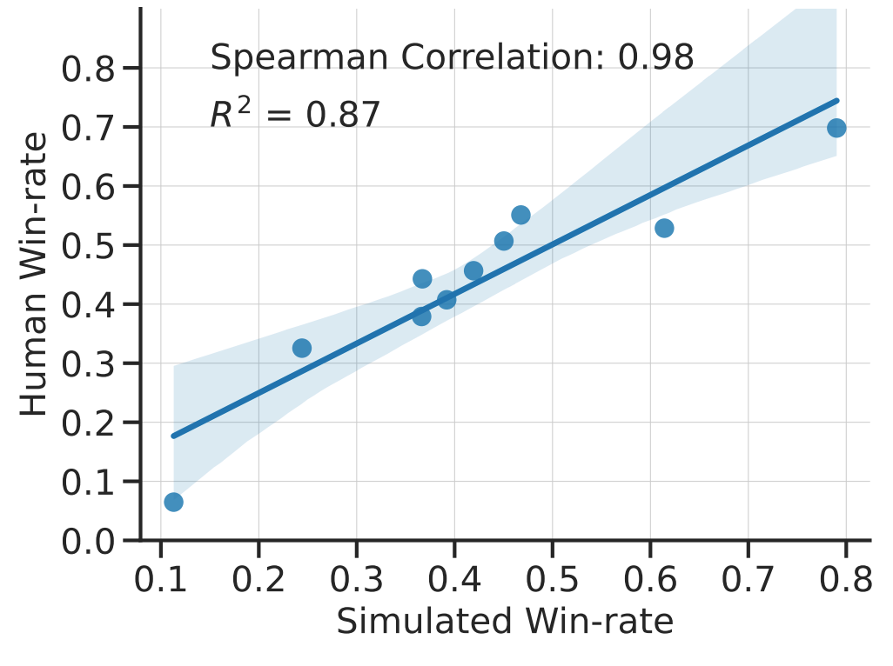

<p align="center" width="100%">
<a href="https://crfm.stanford.edu/alpaca/" target="_blank"></a>
</p>

# AlpacaFarm: A Simulation Framework for <br/>Methods that Learn from Human Feedback

[](https://github.com/tatsu-lab/alpaca_farm/blob/main/LICENSE)
[](https://github.com/tatsu-lab/alpaca_farm/blob/main/DATA_LICENSE)
[](https://www.python.org/downloads/release/python-390/)
[](https://github.com/psf/black)

Research and development on learning from human feedback is difficult because methods like [RLHF](https://arxiv.org/abs/2203.02155) are costly to run and complex to analyze.
AlpacaFarm is a simulator that enables research and development on learning from feedback at a fraction of the usual cost,
promoting accessible research on instruction following and alignment.

This repo contains code for

- [simulating preference feedback from language models](#simulating-pairwise-preference)
- [automated evaluation of instruction-following models](#running-automatic-evaluation)
- [reference implementations of baseline methods](#running-reference-methods)

**Usage and License Notices**: Alpaca is intended and licensed for research use only. The dataset is CC BY NC 4.0 (
allowing only non-commercial use) and models trained using the dataset should not be used outside of research purposes.
The weight diff is also CC BY NC 4.0 (allowing only non-commercial use).

## The AlpacaFarm

<br>
<p style="text-align:center;">
  
</p>

Instruction-following models are typically developed in 3 steps
1. Supervised fine-tuning with demonstrations
2. Learning from human feedback; usually pairwise preferences
3. Human evaluation with interaction

The goal of AlpacaFarm is to provide three key components that tackles steps 2 and 3: 
low-cost pairwise feedback generators, automated evaluations for methods development, and reference implementations of learning algorithms for comparison and modification. 

To reduce annotation cost, we design prompts for API LLMs (e.g. GPT-4, ChatGPT) that enable us to simulate human feedback for 45x cheaper than crowdworkers.

For the challenge of evaluation, we use user interactions with the Alpaca Demo as guidance and mimic this distribution by combining several existing public evaluation datasets including the self-instruct eval set, the anthropic helpful evaluation, the open assistant evaluation, Koala evaluation, and Vicuna evaluation.
On top of this evaluation distribution, we adopt pairwise evaluation as our protocol and measure the win-rate against Davinci003.

We implement and test several popular learning algorithms (e.g. PPO, expert iteration, best-of-n sampling), and release their implementations as resources.

With this design, we show that our simulation is accurate. When we train and develop methods in simulation, the rankings of these methods agree closely with what we see when we train and develop the same methods using actual human feedback.
<p style="text-align:center;">
  
</p>

## Installation

For basic installation, run

```bash
pip install git+https://github.com/tatsu-lab/alpaca_farm.git
```

To enable FlashAttention and other optimizations, install
the [`flash-attn`](https://github.com/HazyResearch/flash-attention) and [`apex`](https://github.com/NVIDIA/apex)
packages.

## Simulating Pairwise Preference

**Notebook example:** [](https://colab.research.google.com/github/YannDubs/lossyless/blob/main/notebooks/Hub.ipynb) 

<details>
  <summary><b>Installing auto annotators with minimal dependencies</b></summary>
    To install only the auto annotators with minimal additional packages use the following
    
    ```
    MINIMAL_DEPENDENCIES=1
    pip install alpacafarm[annotations]
    ```
</details>

To get started either go through the colab notebook above or run one of the two following commands depending on the format of your data.

<details>
<summary><b>Annotating list of pairs of outputs</b></summary>
<pre><code class="python">
from alpaca_farm.auto_annotations import PairwiseAutoAnnotator
from alpaca_farm.utils import jload

# load some data
outputs_pairs = jload("examples/data/outputs_pairs.json")[:6]
print(outputs_pairs[-1:])
# [{'instruction': 'If you could help me write an email to my friends inviting them to dinner on Friday, it would be greatly appreciated.',
#   'input': '',
#   'output_1': "Dear Friends, \r\n\r\nI hope this message finds you well. I'm excited to invite you to dinner on Friday. We'll meet at 7:00 PM at [location]. I look forward to seeing you there. \r\n\r\nBest,\r\n[Name]",
#   'output_2': "Hey everyone! \n\nI'm hosting a dinner party this Friday night and I'd love for all of you to come over. We'll have a delicious spread of food and some great conversations. \n\nLet me know if you can make it - I'd love to see you all there!\n\nCheers,\n[Your Name]"}]

annotator = PairwiseAutoAnnotator()
annotated = annotator.annotate_pairs(outputs_pairs)

print(annotated[-1:])
# [{'instruction': 'If you could help me write an email to my friends inviting them to dinner on Friday, it would be greatly appreciated.',
#   'input': '',
#   'output_1': "Dear Friends, \r\n\r\nI hope this message finds you well. I'm excited to invite you to dinner on Friday. We'll meet at 7:00 PM at [location]. I look forward to seeing you there. \r\n\r\nBest,\r\n[Name]",
#   'output_2': "Hey everyone! \n\nI'm hosting a dinner party this Friday night and I'd love for all of you to come over. We'll have a delicious spread of food and some great conversations. \n\nLet me know if you can make it - I'd love to see you all there!\n\nCheers,\n[Your Name]",
#   'annotator': 'davinci003_3',
#   'preference': 1.0}]
</code></pre>
</details>


<details>
<summary><b>Annotating list of output samples (not pairs)</b></summary>
```python
from alpaca_farm.auto_annotations import PairwiseAutoAnnotator
from alpaca_farm.utils import jload

# load some data
outputs_samples = jload("examples/data/multisamples_sft.json")[:3]
print(outputs_samples)
# ([{'instruction': 'Why is it important to save money?',)
# (  'input': '',)
# (  'output': 'Saving money is important because it allows you to have financial security in case of emergencies; to be able to afford the things you need; to have money for retirement; and to be able to afford the lifestyle you want. Saving money can also help you build wealth and reach your financial goals. It is important to develop the habit of regularly putting money aside for savings.'},)
# ( {'instruction': 'Why is it important to save money?',)
# (  'input': '',)
# (  'output': 'It is important to save money because it can help create a financial cushion in case of an emergency, allow you to pursue goals, and give you more financial security. Having a savings can also give you the opportunity to make more money by investing it. Saving money can also help you prepare for big expenditures, such as buying a car or a house.'},)
# ( {'instruction': 'Why is it important to save money?',)
# (  'input': '',)
# (  'output': 'Saving money is important because it provides financial security and allows for the purchase of large-ticket items, such as a car or house, or for emergency situations. It also helps to create financial independence and allows for more flexibility in life, such as taking unpaid time off from work or retiring early. Having money saved also provides peace of mind, knowing that one is prepared for any unexpected events.'}])

annotator = PairwiseAutoAnnotator()
annotated = annotator.annotate_samples(outputs_samples)

print(annotated)
[{'instruction': 'Why is it important to save money?',
#   'input': '',
#   'output_1': 'Saving money is important because it allows you to have financial security in case of emergencies; to be able to afford the things you need; to have money for retirement; and to be able to afford the lifestyle you want. Saving money can also help you build wealth and reach your financial goals. It is important to develop the habit of regularly putting money aside for savings.',
#   'output_2': 'Saving money is important because it provides financial security and allows for the purchase of large-ticket items, such as a car or house, or for emergency situations. It also helps to create financial independence and allows for more flexibility in life, such as taking unpaid time off from work or retiring early. Having money saved also provides peace of mind, knowing that one is prepared for any unexpected events.',
#   'annotator': 'davinci003_3',
#   'preference': 1.0}]
```
</details>

## Running Automatic Evaluation

## Running Reference Methods

### Citation

Please consider citing our work if you use the data or code in this repo.

```
TODO
```
