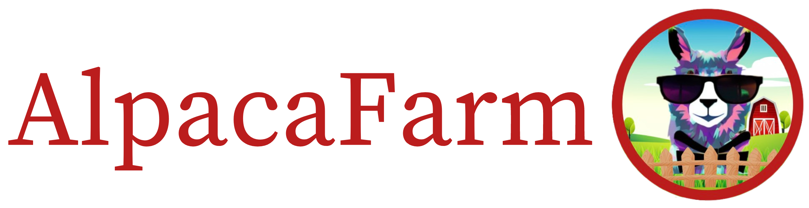
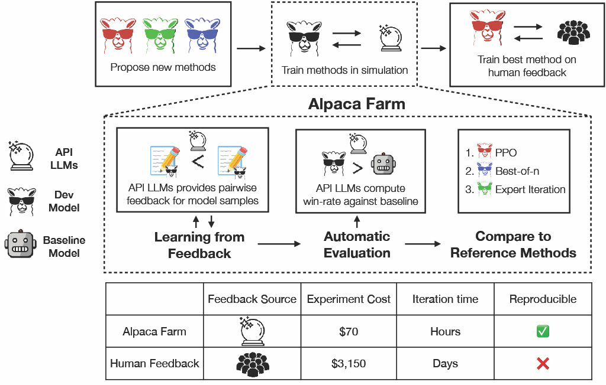

<p align="center" width="100%">

</p>

# AlpacaFarm: A Simulation Framework for Methods that <br/>Learn from Human Feedback

[](https://github.com/tatsu-lab/alpaca_farm/blob/main/LICENSE)
[](https://github.com/tatsu-lab/alpaca_farm/blob/main/DATA_LICENSE)
[](https://www.python.org/downloads/release/python-3100/)
[](https://github.com/psf/black)


**Changing auto-annotators**: `text-davinci-003` is [now depreciated](https://platform.openai.com/docs/deprecations) by OpenAI, as a result, we can't use the original pool of annotators for automatically generating preferences (for fine-tuning or evaluation). We, therefore, switched to the GPT-4 annotator from [AlpacaEval 1](https://github.com/tatsu-lab/alpaca_eval). All results should thus be compared to models from AlpacaEval 1 rather than the original AlpacaFarm results. Note that over-optimization might not be seen in this new setting (see Figure 4 in the [paper](https://arxiv.org/abs/2305.14387)). We are sorry for the inconvenience caused.

---

Research and development on learning from human feedback is difficult because methods
like [RLHF](https://arxiv.org/abs/2203.02155) are complex and costly to run.
AlpacaFarm is a simulator that enables research and development on learning from feedback at a fraction of the usual
cost, promoting accessible research on instruction following and alignment.

Please read our [paper](https://arxiv.org/abs/2305.14387)
and [blog post](https://crfm.stanford.edu/2023/05/22/alpaca-farm.html) for details on our research findings.

This repo contains code for

- [simulating preference feedback from language models such as GPT-4](#simulating-pairwise-preference)
- [automated evaluation for instruction-following models](#running-automatic-evaluation)
- [validated reference implementations of baseline methods such as PPO and best-of-n](#running-reference-methods)

The data needed to run our code is hosted on HuggingFace: <https://huggingface.co/datasets/tatsu-lab/alpaca_farm>.

**Usage and License Notices**: AlpacaFarm is intended and licensed for research use only.
The dataset is CC BY NC 4.0 (allowing only non-commercial use) and models trained using the dataset should not be used
outside of research purposes.
The weight diff is also CC BY NC 4.0 (allowing only non-commercial use).

## The AlpacaFarm

<br>
<p style="text-align:center;">
  
</p>

Instruction-following models are typically developed in 3 steps

1. Supervised fine-tuning with demonstrations
2. Learning from human feedback; usually pairwise preferences
3. Human evaluation with interaction

The goal of AlpacaFarm is to provide three key components that tackles steps 2 and 3:
Low-cost simulation of pairwise feedback from API models (e.g. GPT-4, ChatGPT), automated evaluations for methods
development, and reference implementations of
learning algorithms for comparison and modification.

## Installation

To install the stable release, run

```bash
pip install alpaca-farm
```

To install from the latest commit on `main` branch, run

```bash
pip install git+https://github.com/tatsu-lab/alpaca_farm.git
```

To enable FlashAttention and other optimizations, install
the [`flash-attn`](https://github.com/HazyResearch/flash-attention) and [`apex`](https://github.com/NVIDIA/apex)
packages.

## Simulating pairwise preference

**Notebook
example:** [](https://colab.research.google.com/github/tatsu-lab/alpaca_farm/blob/main/examples/auto_annotations.ipynb)

For all the evaluation and annotations we use [**AlpacaEval**](https://github.com/tatsu-lab/alpaca_eval/tree/main#making-a-new-evaluator) with our pool of automatic annotators and additional noise to simulate the variance of human annotations.

To get started, set the environment variable `OPENAI_API_KEY` to your OpenAI API key, and (optionally) `OPENAI_ORG` to
the
organization ID.
You can do this by running

```bash
export OPENAI_API_KEY="sk..."
```

To annotate the pairs of outputs of your model use the following code.
For more details or functions to use if you have outputs in different formats refer to
the [example notebook](https://github.com/tatsu-lab/alpaca_farm/blob/main/examples/auto_annotations.ipynb).

```python
from alpaca_farm.auto_annotations import PairwiseAutoAnnotator
import json

# load some data
with open("examples/data/outputs_pairs.json") as f:
    outputs_pairs = json.load(f)[:6]
print(outputs_pairs[-1:])
# [{'instruction': 'If you could help me write an email to my friends inviting them to dinner on Friday, it would be greatly appreciated.',
#   'input': '',
#   'output_1': "Dear Friends, \r\n\r\nI hope this message finds you well. I'm excited to invite you to dinner on Friday. We'll meet at 7:00 PM at [location]. I look forward to seeing you there. \r\n\r\nBest,\r\n[Name]",
#   'output_2': "Hey everyone! \n\nI'm hosting a dinner party this Friday night and I'd love for all of you to come over. We'll have a delicious spread of food and some great conversations. \n\nLet me know if you can make it - I'd love to see you all there!\n\nCheers,\n[Your Name]"}]

annotator = PairwiseAutoAnnotator()
annotated = annotator.annotate_pairs(outputs_pairs)

print(annotated[-1:])
# [{'instruction': 'If you could help me write an email to my friends inviting them to dinner on Friday, it would be greatly appreciated.', 
# 'input': '', 
# 'output_1': "Dear Friends, \r\n\r\nI hope this message finds you well. I'm excited to invite you to dinner on Friday. We'll meet at 7:00 PM at [location]. I look forward to seeing you there. \r\n\r\nBest,\r\n[Name]", 
# 'output_2': "Hey everyone! \n\nI'm hosting a dinner party this Friday night and I'd love for all of you to come over. We'll have a delicious spread of food and some great conversations. \n\nLet me know if you can make it - I'd love to see you all there!\n\nCheers,\n[Your Name]",
# 'annotator': 'chatgpt_2', 
# 'preference': 2}]
```

If instead of pairs you have a list of sampled outputs, you can use the following.

```python
multisample_outputs = [dict(instruction="repeat the following", input="yes", output=["yes", "no", "maybe", "repeat"])]
print(annotator.annotate_samples(multisample_outputs))
# [{'sample_id': 0, 
#   'instruction': 'repeat the following', 
#   'input': 'yes', 
#   'output_1': 'yes', 
#   'output_2': 'maybe', 
#   'annotator': 'chatgpt_2', 
#   'preference': 1}]
```

## Running automatic evaluation

For all the evaluation we use [**AlpacaEval**](https://github.com/tatsu-lab/alpaca_eval/tree/main#making-a-new-evaluator) with our pool of automatic annotators. 

To get started, set the environment variable OPENAI_API_KEY to your OpenAI API key, and (optionally) OPENAI_ORG to the
organization ID. You can do this by running

```bash
export OPENAI_API_KEY="sk..."
```

The easiest to add your model to the Alpaca Leaderboard is to run the following code, which only requires having outputs
for your model on our eval data.

```python
from alpaca_farm.auto_annotations import alpaca_leaderboard
import datasets

# predict on Alpaca eval data
alpaca_eval_data = datasets.load_dataset("tatsu-lab/alpaca_farm", "alpaca_farm_evaluation")["eval"]
...  # use the data to get outputs for your model and save it
path_to_outputs = "examples/data/eval_gpt-3.5-turbo-0301.json"
# outputs should be a list of json as such:
# [{'instruction': 'What are the names of some famous actors that started their careers on Broadway?', 'input': '', 'output': 'Some famous actors that started their careers on Broadway are Hugh Jackman, Meryl Streep, Denzel Washington, Audra McDonald, and Lin-Manuel Miranda.', 'generator': 'gpt-3.5-turbo-0301', 'dataset': 'helpful_base', 'datasplit': 'eval'},
# ...]

alpaca_leaderboard(path_to_outputs, name="My fancy model")
#                               win_rate  standard_error  n_total  avg_length
# gpt35_turbo_instruct             81.71            1.33      801        1018
# alpaca-farm-ppo-sim-gpt4-20k     44.10            1.74      805         511
# My fancy model                   41.54            2.01      597         327
# alpaca-farm-ppo-human            41.24            1.73      805         803
# alpaca-7b                        26.46            1.54      805         396
# text_davinci_001                 15.17            1.24      804         296
```

## Running reference methods

We provide reference implementations of several methods for learning from pairwise feedback.
Example code to run these methods can be found in the `examples/` directory.
This includes [supervised fine-tuning](examples/supervised.py), [reward modeding](examples/reward_modeling.py)
, [RLHF with PPO](examples/rlhf_ppo.py), [best-of-n decoding](examples/best_of_n.py) and more.

Below we give example commands for reproducing the model artifacts in our paper. Notes:

- All training code are tested with FlashAttention enabled on a machine with 8 80GB A100 GPUs.
- Best-of-n decoding was tested with a single 80GB GPU.
- Supervised fine-tuning and reward modeling can fit on 4 80GB A100 GPUs, while PPO training currently requires at least
  8
  80GB GPUs.
- Before running the code below, make sure to convert your LLaMA checkpoint and tokenizer into HuggingFace format and
  store it at `<your_path_to_hf_converted_llama_ckpt_and_tokenizer>`.

### Supervised fine-tuning (SFT)

To replicate our SFT10k model fine-tuned from LLaMA in the paper, run

```bash
bash examples/scripts/sft.sh \
  <your_output_dir_for_sft10k> \
  <your_wandb_run_name> \
  <your_path_to_hf_converted_llama_ckpt_and_tokenizer>
```

The SFT10k model will be saved at `<your_output_dir>`, and the name of the wandb run will be `<your_wandb_run_name>`.

### Reward modeling

To replicate our reward models trained in the paper, run

```bash
bash examples/scripts/reward_modeling.sh \
  <your_output_dir_for_reward_model> \
  <your_wandb_run_name> \
  <your_output_dir_for_sft10k> \
  <preference_dataset_name>
```

Set `<preference_dataset_name>` to `"alpaca_noisy_multi_preference"` for simulated preference reward model, and
`"alpaca_human_preference"` for human preference reward model.

### RLHF with PPO

To replicate our RLHF PPO model trained with simulated reward model in the paper, run

```bash
bash examples/scripts/rlhf_ppo.sh \
  <your_output_dir_for_ppo> \
  <your_wandb_run_name> \
  <your_output_dir_for_reward_model> \
  <your_output_dir_for_sft10k> \
  <kl_coef>
```

`<your_output_dir_for_reward_model>` should point to either simulated reward model or human reward model trained
according
to the previous step.
Note the KL penalty coefficient for human reward PPO is much larger than for simulated PPO.
Set `<kl_coef>` to `0.0067` for simulated PPO, and `0.02` for human PPO to recover our original results.
Performance of the PPO model is typically much better than SFT at 20-80 PPO steps (less than 4 passes through the entire
set of instructions) and starts to decay with more PPO steps.

### Best-of-n decoding

To replicate our best-of-n inference-time decoding results for the AlpacaFarm evaluation suite, run

```bash
python examples/best_of_n.py \
  --task "run_best_of_n" \
  --decoder_name_or_path <your_output_dir_for_decoder> \  # Can be SFT model or even PPO tuned model.
  --scorer_name_or_path <your_output_dir_for_reward_model> \
  --num_return_sequences 16 \  # This is the n in best-of-n.
  --per_device_batch_size 4 \  # Reduce this if you don't have enough memory.
  --split "eval" \
  --mixed_precision "bf16" \
  --tf32 True \
  --flash_attn True \
  --output_path <your_output_path_to_store_samples>
```

You can then use the generated samples at `<your_output_path_to_store_samples>` directly with our automated evaluation.

### Expert Iteration

To replicate our expert iteration results for the AlpacaFarm evaluation suite, first produce best-of-n samples. Run

```bash
python examples/best_of_n.py \
  --task "run_best_of_n" \
  --decoder_name_or_path <your_output_dir_for_decoder> \  # SFT10k model.
  --scorer_name_or_path <your_output_dir_for_reward_model> \
  --num_return_sequences 16 \  # This is the n in best-of-n.
  --per_device_batch_size 4 \  # Reduce this if you don't have enough memory.
  --split "unlabeled" \
  --mixed_precision "bf16" \
  --tf32 True \
  --flash_attn True \
  --output_path '<your_output_dir_for_expiter_data>/best_of_n_samples.json'
```

Then perform supervised fine-tuning from the SFT10k checkpoint with the best-of-n samples

```bash
bash examples/scripts/expiter.sh \
  <your_output_dir_for_expiter> \
  <your_wandb_run_name> \
  <your_output_dir_for_sft10k> \
  <your_output_dir_for_expiter_data>
```

### Quark

To replicate our Quark results for the AlpacaFarm evaluation suite, run

```bash
bash examples/scripts/rlhf_quark.sh \
  <your_output_dir_for_quark> \
  <your_wandb_run_name> \
  <your_output_dir_for_reward_model> \
  <your_output_dir_for_sft10k> \
  <kl_coef>
```

### [Direct Preference Optimization (DPO)](https://arxiv.org/abs/2305.18290)

To replicate our DPO results for the AlpacaFarm evaluation suite, run

```bash
bash examples/scripts/dpo.sh \
  <your_output_dir_for_dpo> \
  <your_wandb_run_name> \
  <your_output_dir_for_sft10k>
```

### OpenAI models

To run the OpenAI reference models with our prompts and decoding hyperparameters, run

```bash
python examples/oai_baselines.py \
  --model_name <oai_model_name> \
  --save_path <save_path> 
```

You can then use the generated samples at `<save_path>` directly with our automated evaluation.

## Downloading pre-tuned AlpacaFarm models

We provide model checkpoints for reward models and all our reference methods, listed in Table 2 of
our [paper](https://arxiv.org/abs/2305.14387). Concretely, we tune each reference method in AlpacaFarm simulation and on
human preference data and release both versions. The current list of models
(available [here](https://huggingface.co/tatsu-lab)) includes:

- `sft10k`, the supervised learning base model that we collect preference data with.
- `reward-model-sim`, the reward model trained on AlpacaFarm preference data.
- `reward-model-human`, the reward model trained on human preference data.
- `ppo-sim`, the best PPO checkpoint trained in simulation.
- `ppo-human`, the best PPO checkpoint trained on human data.
- `expiter-sim`, the best expert iteration checkpoint trained in simulation.
- `expiter-human`, the best expert iteration checkpoint trained on human data.
- `feedme-sim`, the FeedME method trained on simulated preferences.
- `feedme-human`, the FeedME method trained on human preferences.
- `reward-condition-sim`, the reward conditioning method trained on simulated preferences.

To download and recover these checkpoints, first make sure to have a LLaMA-7B
checkpoint [converted into the Hugging Face format](https://huggingface.co/docs/transformers/main/model_doc/llama)
**with transformers>=4.29.2**.
Then, run the following to download all AlpacaFarm models:

```
python -m pretrained_models.recover_model_weights \
  --llama-7b-hf-dir <your_path_to_hf_converted_llama_ckpt_and_tokenizer> \
  --alpaca-farm-model-name all
```

Or, specify a particular model name to download just that model:

```
python -m pretrained_models.recover_model_weights \
  --llama-7b-hf-dir <your_path_to_hf_converted_llama_ckpt_and_tokenizer> \
  --alpaca-farm-model-name <one_of_the_model_names_from_above> \
  --models-save-dir <dir_to_save_all_models>
```

To download either of the reward models individually, you'll need to have `sft10k` downloaded first
to `<dir_to_save_all_models>`.

## Citation

Please consider citing our work if you use the data or code in this repo.

```
@misc{dubois2023alpacafarm,
      title={AlpacaFarm: A Simulation Framework for Methods that Learn from Human Feedback}, 
      author={Yann Dubois and Xuechen Li and Rohan Taori and Tianyi Zhang and Ishaan Gulrajani and Jimmy Ba and Carlos Guestrin and Percy Liang and Tatsunori B. Hashimoto},
      year={2023},
      eprint={2305.14387},
      archivePrefix={arXiv},
      primaryClass={cs.LG}
}
```

If you use `alpaca-farm>=0.2.0` make sure to specify that the annotator changed (as `text-davinci-003` is depreciated). The preferences and win-rates are now from AlpacaEval 1 and are not comparable to the numbers from our paper. You can cite AlpacaEval as:

```
@misc{alpaca_eval,
  author = {Xuechen Li and Tianyi Zhang and Yann Dubois and Rohan Taori and Ishaan Gulrajani and Carlos Guestrin and Percy Liang and Tatsunori B. Hashimoto },
  title = {AlpacaEval: An Automatic Evaluator of Instruction-following Models},
  year = {2023},
  publisher = {GitHub},
  journal = {GitHub repository},
  howpublished = {\url{https://github.com/tatsu-lab/alpaca_eval}}
}
```