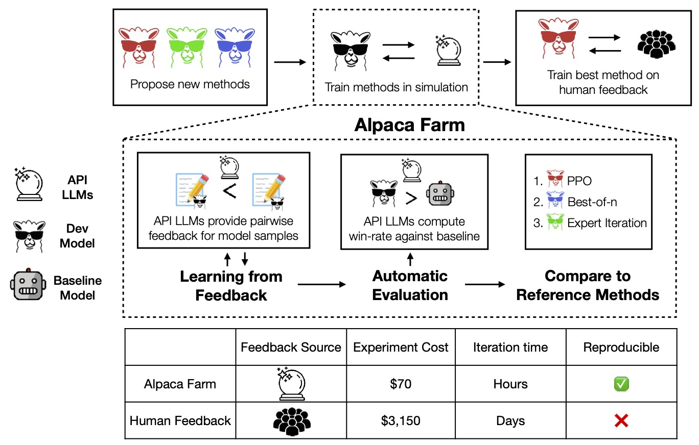

# Stanford AlpacaFarm: A Simulation Framework for <br/>Methods that Learn from Human Feedback

[](https://github.com/tatsu-lab/alpaca_farm/blob/main/LICENSE)
[](https://github.com/tatsu-lab/alpaca_farm/blob/main/DATA_LICENSE)
[](https://www.python.org/downloads/release/python-390/)
[](https://github.com/psf/black)

Research and development on instruction-following models with human feedback is difficult because methods that learn
from human feedback like [RLHF](https://arxiv.org/abs/2203.02155) are costly to run and complex to analyze.
Stanford AlpacaFarm is a simulator that enables research and development for learning from feedback at a low cost,
enabling research on instruction following and alignment to advance.

This repo contains code for

- simulating preference feedback from language models
- automated evaluation of instruction-following models
- reference implementations of baseline methods

**Usage and License Notices**: Alpaca is intended and licensed for research use only. The dataset is CC BY NC 4.0 (
allowing only non-commercial use) and models trained using the dataset should not be used outside of research purposes.
The weight diff is also CC BY NC 4.0 (allowing only non-commercial use).

## The AlpacaFarm

<br>
<p style="text-align:center;">
  
</p>

Instruction-following models are typically developed in 3 steps
1. Supervised fine-tuning with demonstrations
2. Learning from human feedback; usually pairwise preferences
3. Human evaluation with interaction

The goal of AlpacaFarm is to provide three key components that enable rapid research and development of instruction following models: 
low-cost pairwise feedback generators, automated evaluations for methods development, and reference implementations for comparison and modification. 

## Installation

For basic installation, run

```bash
pip install git+https://github.com/tatsu-lab/alpaca_farm.git
```

To enable FlashAttention and other optimizations, install
the [`flash-attn`](https://github.com/HazyResearch/flash-attention) and [`apex`](https://github.com/NVIDIA/apex)
packages.

## Simulating Pairwise Preference

## Running Automatic Evaluation

## Running Reference Methods

### Citation

Please consider citing our work if you use the data or code in this repo.

```
TODO
```
